# Confluent Cloud Setup

This guide walks through setting up Confluent Cloud using Docker containers.

## Prerequisites

- Bash shell
    - Will not work in Cloud Shell or WSL1
- Java 11+ ([download](https://www.oracle.com/java/technologies/javase-jdk11-downloads.html))
- Maven ([download](https://maven.apache.org/download.cgi))
- Docker ([download](https://www.docker.com/products/docker-desktop))
- CosmosDB [Setting up an Azure Cosmos DB Instance](CosmosDB_Setup.md)

## Setup

### Create Confluent Cloud Account and Setup Cluster
Go to [create account](https://www.confluent.io/get-started/) and fill out the appropriate fields.

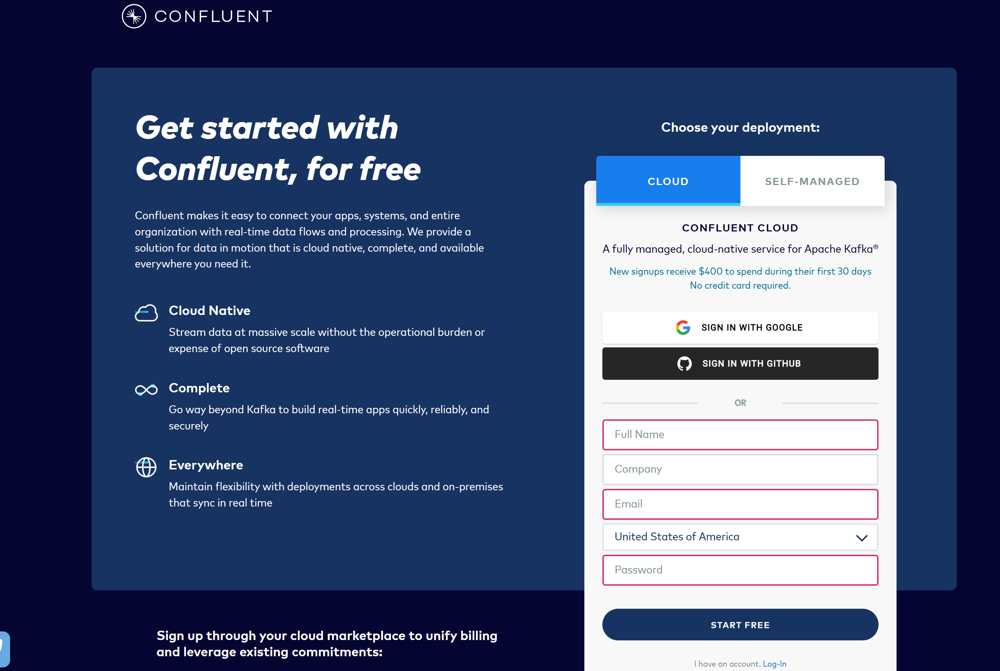

---

Select environments. 

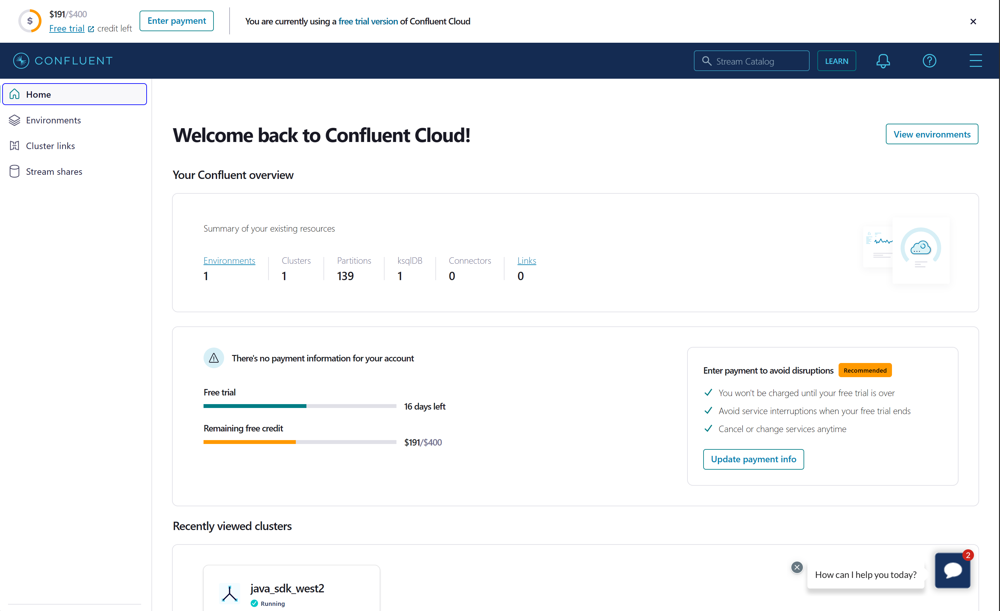

---

Select default which is an environment automatically setup by confluent. 

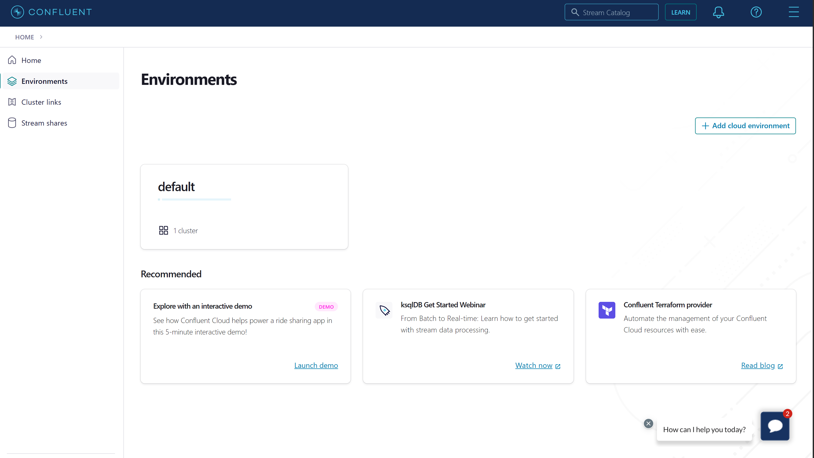

---

- Select add cluster. 

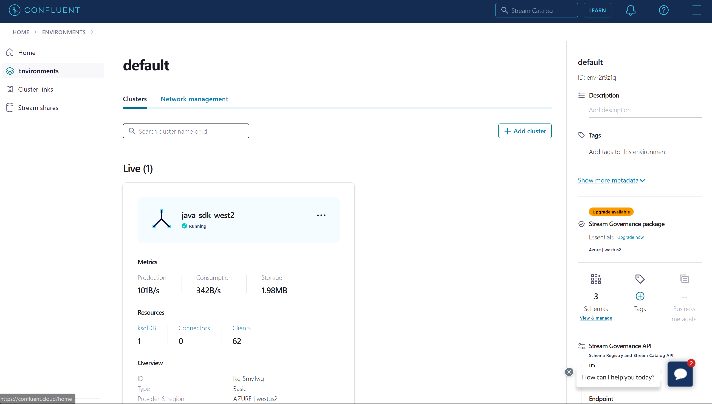

---

- Select Azure create the cluster and choose the same region as the Cosmos DB instance you created.

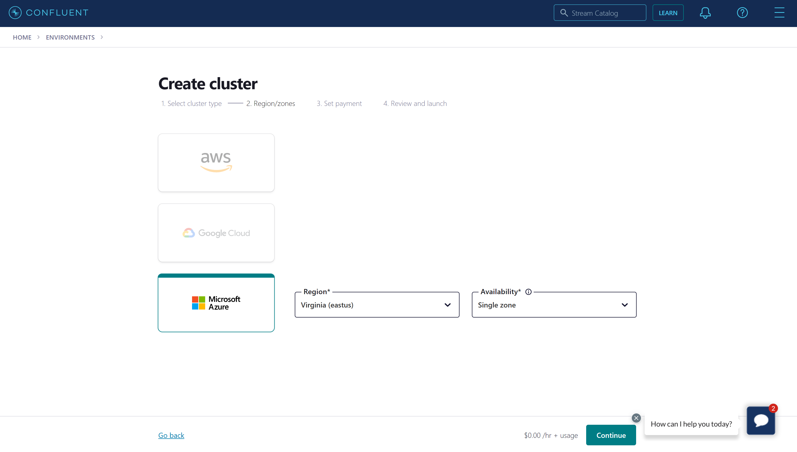

---

- Name the cluster, and then select launch cluster.

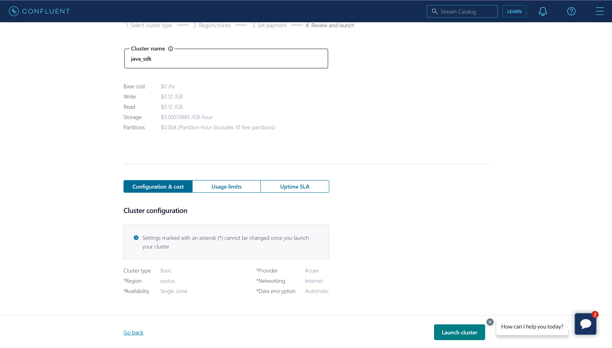


### Create ksqlDB Cluster
From inside the cluster select ksqlDB. Select add cluster. Select continue, name the cluster, and then select launch.

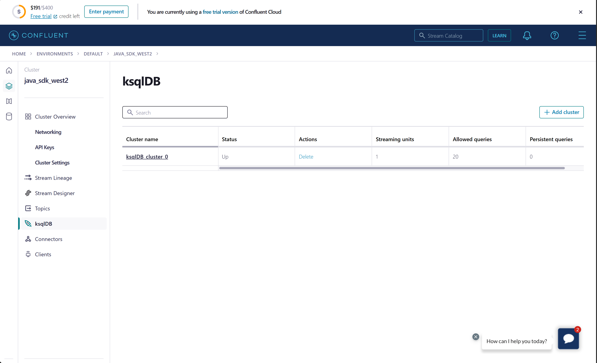

### Create Schema Registry 
From inside the confluent environment in the right panel select enable schema governance. 

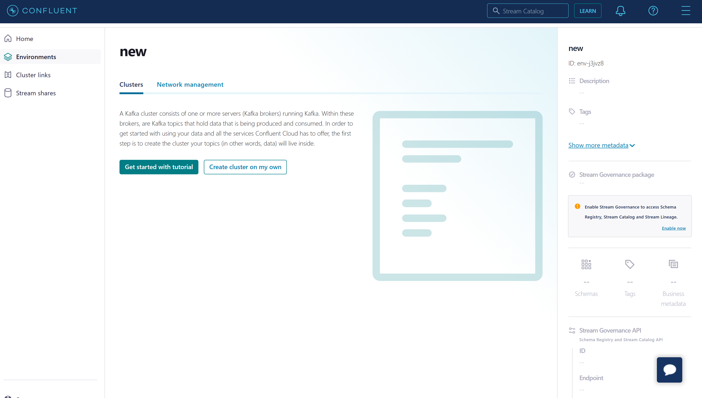

---

Then select the region for azure and select enable.

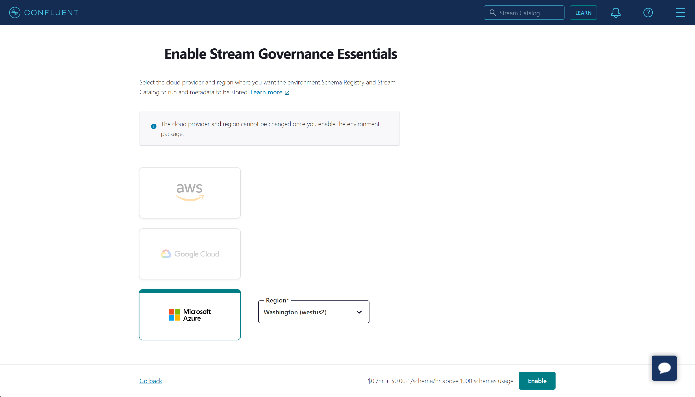

### Update Configurations
Update the sink and source connectors configuration files located in `src/test/resources` by filling out the values for `connect.cosmos.connection.endpoint` and `connect.cosmos.master.key`, which you should have saved from the [Cosmos DB setup guide](CosmosDB_Setup.md).

```bash
cd kafka-connect-cosmosdb

# copy the template connector configs into src/test/resources
# you will need to update the configs for the Cosmos values as mentioned above

cp src/docker/resources/sink.example.json src/test/resources/sink.config.json
cp src/docker/resources/source.example.json src/test/resources/source.config.json
```
Update the `src/main/java/com.azure.cosmos.kafka.connect/ConnectorTestConfigurations` file with the following configurations.
- The cluster key and secret can be found under api keys in the cluster. Choose the one for ksqlDB.
- The `BOOTSTRAP_SERVERS` endpoint can be found in the cluster under cluster settings and end endpoints.
- The schema registry key and secret can be found on the bottom of the right panel inside the confluent environment under credentials.
- The schema registry url can be found on the bottom of the right panel inside the confluent environment under Endpoint.

Update the `src/docker/.env` file with the same configurations as above. Make sure to follow the following format for the `SASL_JAAS_CONFIG` and the `SCHEMA_REGISTRY_BASIC_AUTH_USER_INFO`.

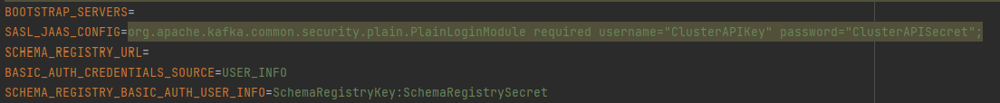
### Start Confluent Platform Docker
> May take several minutes to run in order to download docker images for the Confluent platform components.

```bash
cd $REPO_ROOT/src/docker/ 

./startup.sh

# verify the services are up and running
docker-compose ps
```
### Create Topic in Confluent Cloud UI
Any topic used in the integration tests will need to be created in Confluent Cloud or through the [Confluent Cli](https://docs.confluent.io/cloud/current/client-apps/topics/manage.html#:~:text=Confluent%20CLI%20Follow%20these%20steps%20to%20create%20a,aren%E2%80%99t%20any%20topics%20created%20yet%2C%20click%20Create%20topic.) (Requires installing the Confluent Cli first). 
This will show how to create one through Confluent Cloud UI. 

Inside the Cluster Overview, scroll down and select topics and partitions.

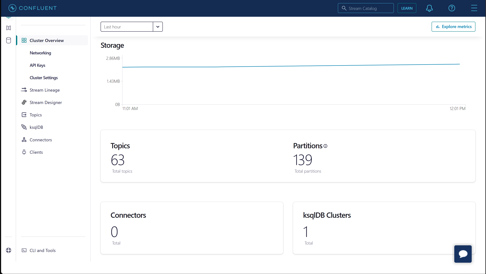

---

Select add topic.

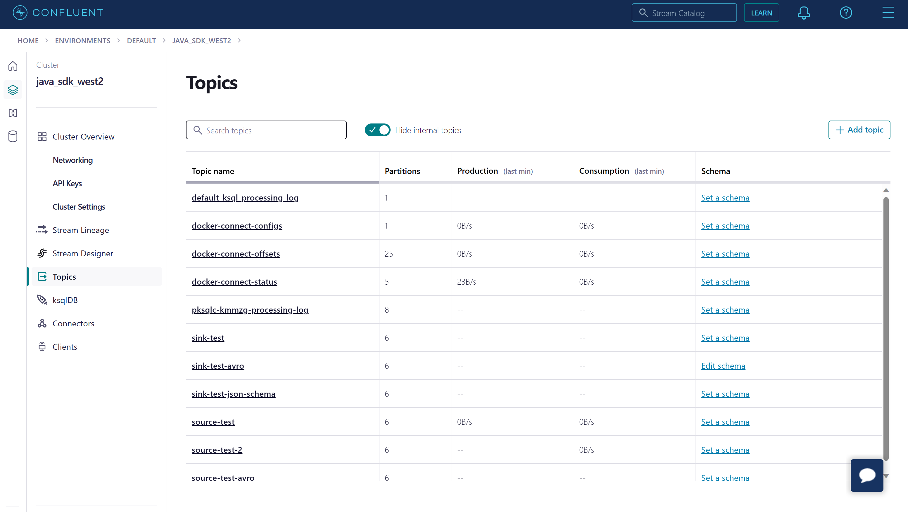

---

Name the topic and select create with defaults. Afterward, a prompt will appear about creating a schema. This can be
skipped as the tests will create the schemas.

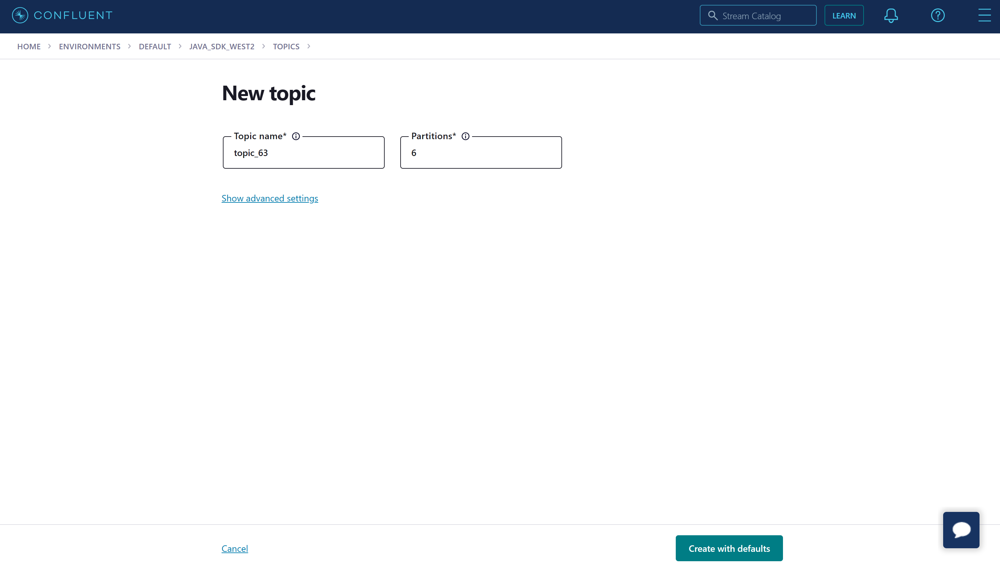

### Running Integration Tests

Navigate to root project directory and execute the integration tests. Run startup.sh to rebuild the jar for the connector as necessary.

```bash
# run the integration tests
mvn clean test-compile failsafe:integration-test
```

### Cleanup

Tear down the Confluent Platform setup and cleanup any unnecessary resources

```bash

cd $REPO_ROOT/src/docker

# bring down all docker containers
docker-compose down

# remove dangling volumes and networks
docker system prune -f --volumes --filter "label=io.confluent.docker"

```


## Common Errors

### Topic not found
`org.apache.kafka.common.errors.TimeoutException: Topic sink-test-json-schema not present in metadata after 2000 ms.`
- Create the topic used in the corresponding test in Confluent Cloud 

## Resources to Improve Infrastructure
- [Docker Configurations](https://docs.confluent.io/platform/current/installation/docker/config-reference.html)
- [Configuration Options](https://docs.confluent.io/platform/current/installation/configuration/index.html)
- [Connect Confluent Platform Components to Confluent Cloud](https://docs.confluent.io/cloud/current/cp-component/index.html)
