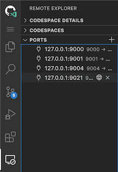

# Confluent Platform Setup

This guide walks through setting up Confluent Platform using Docker containers.

## Prerequisites

- Bash shell (tested on Github Codespaces, Mac, Ubuntu, Windows with WSL2)
  - Will not work in Cloud Shell or WSL1
- Java 11+ ([download](https://www.oracle.com/java/technologies/javase-jdk11-downloads.html))
- Maven ([download](https://maven.apache.org/download.cgi))
- Docker ([download](https://www.docker.com/products/docker-desktop))
- Powershell (optional) ([download](https://docs.microsoft.com/en-us/powershell/scripting/install/installing-powershell))

## Setup

> [Github Codespaces](https://github.com/features/codespaces) is the easiest way to evaluate the Cosmos DB Kafka Connectors as all of the prerequisites are automatically installed
>
> Follow the setup steps in the [developer setup](../DEVELOPER_WALKTHROUGH.MD) to setup Codespaces

### Initialize repo

Clone the Kafka Connect Cosmos DB repo

```bash

### skip this step if using Codespaces

git clone https://github.com/microsoft/kafka-connect-cosmosdb.git

cd kafka-connect-cosmosdb
export REPO_ROOT=$(pwd)

```

### Startup

Start up the docker containers for Confluent Platform using `docker-compose`

```bash

cd $REPO_ROOT/src/integration-test

# If you're using codespaces, either option will work.
# Otherwise, use the setup best suited to your shell environment.

# Running either script for the first time may take several minutes to run in order to download the necessary docker images.

# Option 1: Use the bash script to setup
./startup.sh

# Option 2: Use the powershell script to setup
pwsh startup.ps1

# verify the services are up and running
docker-compose ps

```

> If you are **not** using Codespaces and the containers fail to come up, you may need to increase the memory allocation for Docker to 3 GB or more.
>
> Rerun the startup script to reinitialize the docker containers.

Your Confluent Platform setup is now ready to use!

### Access Confluent Platform components

All of the Confluent Platform services should now be accessible on `localhost`. You can also access the web interfaces for some services as shown below.

> If you're using Codespaces, you need to go through the forwarded ports to view the following webpages. Navigate to the 'Forwarded Ports' section in the 'Remote Explorer' extension to access these forwarded ports.



> Alternatively, `localhost` addresses will automatically redirect from within the Codespaces instance. For more information on accessing forwarded ports in Codespaces, refer to these [docs](https://docs.github.com/en/free-pro-team@latest/github/developing-online-with-codespaces/developing-in-a-codespace#forwarding-ports).

| Name | Address | Description |
| --- | --- | --- |
| Control Center | <http://localhost:9021> | The main webpage for all Confluent services where you can create topics, configure connectors, interact with the Connect cluster and more. |
| Kafka Topics UI | <http://localhost:9000> | Useful to viewing Kafka topics and the messages within them. |
| Schema Registry UI | <http://localhost:9001> | Can view and create new schemas, ideal for interacting with Avro data.  |
| ZooNavigator | <http://localhost:9004> | Web interface for Zookeeper. Refer to the [docs](https://zoonavigator.elkozmon.com/en/stable/) for more information. |

### Clean up

Tear down the Confluent Platform setup and clean up any unneeded resources

```bash

cd $REPO_ROOT/src/integration-test

# bring down all docker containers
docker-compose down

# clean up dangling volumes and networks
docker system prune -f --volumes

```
