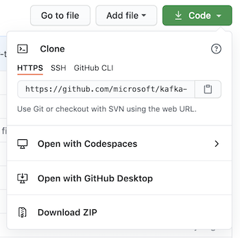
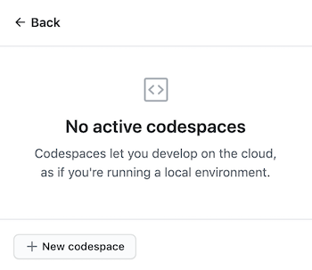
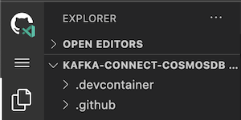

# Developer Walkthrough and Project Setup

## Setup

Github Codespaces is the easiest way to evaluate this repository as all of the prerequisites are automatically installed. If you want to setup locally instead of through Codespaces, using a Dev Container with Visual Studio Code is recommended as the Java based prerequisites are automatically installed.

### Github Codespaces

- Open the Github repo in a web browser
  - [kafka-connect-cosmosdb](https://github.com/microsoft/kafka-connect-cosmosdb)
- Click on the `Code` button



- Click on `Open with Codespaces`
- Click on the `New codespace` button



- Codespaces will display a Creation Log window
  - You may close this window once all the steps have completed
- Open a terminal in Codespaces
  - Use the command palette or press ctl + `
  - You can also click on the Menu button in the upper left corner
    - choose view
    - choose terminal



To manage your codespaces, visit the [Github Codespaces page](https://github.com/codespaces).

### Dev Container using Visual Studio Code

#### Prerequisites (Dev Container setup)

Ensure you have the following prerequisites installed.

- Docker ([download](https://www.docker.com/products/docker-desktop))
- Visual Studio Code ([download](https://code.visualstudio.com/download))
- VS Code Remote Development Extension Pack ([download](https://aka.ms/vscode-remote/download/extension))

#### Dev Container Installation

Setup a Dev Container for the [kafka-connect-cosmosdb](https://github.com/microsoft/kafka-connect-cosmosdb) repo by cloning it in a Docker container.

- In VS Code, open the `Remote Explorer` menu from the left sidebar and click on the `Clone Repository in Container Volume` option as shown below. Alternatively, you can open up the Command Palette (`F1` key) and search for `Remote Containers: Clone Repository`


- Enter the URL for the kafka-connect-cosmosdb repo
  - <https://github.com/microsoft/kafka-connect-cosmosdb>
- Select the `Create a new volume` option.
- Use the default values for the volume name and target folder name. If the default values are not pre-filled, use `vs-remote-container` for the volume name and `kafka-connect-cosmosdb` for the target folder name.
- The VS Code window will reload and start building the dev container, which can take several minutes. You only have to build a dev container the first time you open it; opening the folder after the first successful build will be much quicker.


You can manage your dev containers from the `Remote Explorer` menu from the left sidebar of Visual Studio Code (as shown previously in the first step of installation).

For more information on working with Dev Containers in Visual Studio Code, refer to the [documentation](https://code.visualstudio.com/docs/remote/containers).

### Manual Setup

#### Prerequisites (manual setup)

Ensure you have the following prerequisites installed.

- Bash shell (tested on Github Codespaces, Mac, Ubuntu, Windows with WSL2)
  - Will not work in Cloud Shell or WSL1
- Docker ([download](https://www.docker.com/products/docker-desktop))
- Git
- Java 11+ ([download](https://www.oracle.com/java/technologies/javase-jdk11-downloads.html))
- Maven ([download](https://maven.apache.org/download.cgi))

#### Manual Installation

Clone the Github repo microsoft/kafka-connect-cosmosdb GitHub repository.
  
```bash

git clone https://github.com/microsoft/kafka-connect-cosmosdb.git

```

- Configure IDE to use a JDK by one of the following way.
  - Setting the value of the `JAVA_HOME` [system environment variable](https://docs.oracle.com/cd/E19182-01/821-0917/inst_jdk_javahome_t/index.html) to the install location of the JDK, for example, `C:\Program Files\Java\jdk-13.0.2`.
  - if you want to configure only VS Code to use the JDK, use the `java.home` setting in [VS Code's User or Workspace settings](https://code.visualstudio.com/docs/getstarted/settings)
- Download maven dependencies.

## Testing

### Unit Tests

Navigate to root project directory and execute unit tests

```bash

cd kafka-connect-cosmosdb
mvn clean test

```

### Integration Tests

To run the integration tests, you will need to first setup the following resources:

- [Confluent Platform](Confluent_Platform_Setup.md)
- [Setting up an Azure Cosmos DB Instance](CosmosDB_Setup.md)

Update the sink and source connectors configuration files located in `src/test/resources` by filling out the values for `connect.cosmosdb.connection.endpoint` and `connect.cosmosdb.master.key`, which you should have saved from the [Cosmos DB setup guide](CosmosDB_Setup.md).

Navigate to root project directory and execute the integration tests

```bash

cd kafka-connect-cosmosdb
mvn clean test-compile failsafe:integration-test

```

## Configure Confluent Platform, Cosmos DB and validate Kafka Connectors

- [Confluent Platform Setup](Confluent_Platform_Setup.md)
- [Setting up an Azure Cosmos DB Instance](CosmosDB_Setup.md)
- [Kafka Connect Cosmos DB Sink Connector](README_Sink.md)
- [Kafka Connect Cosmos DB Source Connector](README_Source.md)
