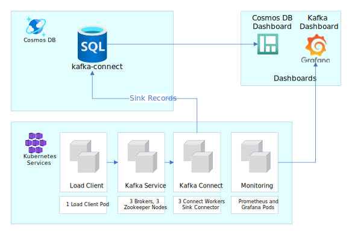
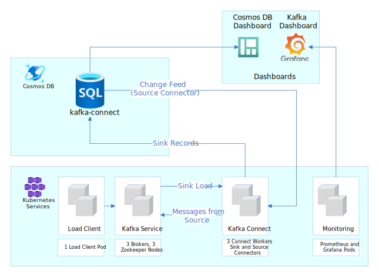

# Cosmos DB Connectors Performance Testing

## Test Infrastructure

In order to easily and quickly deploy and tear-down the testing workloads, we've used a Kubernetes Cluster (specifically an Azure Kubernetes Service cluster) as the foundation. The following is a list of specifications for the AKS Cluster.

- 3 nodes each with VM flavor `Standard_F4s_v2`
- `Standard_F4s_v2` consists of 4 vCPUs, 8 GiB memory, 32 GB SSD storage. More info can be found in these [docs](https://docs.microsoft.com/en-us/azure/virtual-machines/fsv2-series).
- Kubernetes Version: `1.19.6`
- Helm version: `v3.3.4`

The AKS cluster consists of three main components needed for the testing:

1. Kafka Service
2. Kafka Connect Cluster
3. Load Client (Sink Load Generator and implicitly a Source load generator as well)

In addition, a Cosmos DB instance is used in the tests. Refer to the [setup guide](./CosmosDB_Setup.md) for more information for creating an instance.

### Kafka Service

The main Kafka backend was installed via the upstream [Confluent Inc. helm charts](https://github.com/confluentinc/cp-helm-charts) using the default values. However, only the following subset of the Kafka services were included in the installation:

- Kafka Brokers (3 replicas)
- ZooKeeper (3 replicas)
- Confluent REST Proxy
- Confluent Schema Registry

In addition, we installed Prometheus and Grafana to monitor relevant Kafka metrics. We used the upstream [Confluent Inc. dashboard template](https://github.com/confluentinc/cp-helm-charts/tree/master/grafana-dashboard) to visualize the standard Kafka components in Grafana.

### Kafka Connect

The connect cluster used for the performance testing consists of **three** workers (pods in the k8s context). Each worker pod has the following specifications:

- 2.66 cores (approx. 8 cores across all 3 workers)
- 2Gib Memory
- 2GB Heap

The worker pods are built with a [custom Docker image](../src/docker/Dockerfile), created using the upstream Kafka connect image as a base and the Cosmos DB connectors code installed on top.

The steps for installing Kafka and the Connect cluster can be found in this [documentation](../src/perf/README.md#deploy-kafka-and-kafka-connect-with-helm).

### Load Client

We used the `kafka-producer-perf-test` CLI to generate load into a single Kafka topic. This CLI is included in within a [custom Docker image](../src/docker/Dockerfile.sinkperf), created using the upstream Kafka client image as a base. The custom image is built with JSON payload files (from 100B to 50kB for each message) that are used for generating the load. Similarly to installing the Kafka connect cluster, the load client can be deployed using a Helm chart (steps can be found [here](../src/perf/README.md#deploy-kafka-load-client)). One thing to note is that load client is installed in the same namespace that the Kafka pods are installed such that the traffic is sent via the local network.

The load client directly works with the Sink connector since load is generated into a Kafka topic and the connector can ingest this traffic. We also use the same load client with the source connector and this approach is a bit more implicit.

For example, we have the load client sending messages into a Kafka topic, and a sink connector is setup to send these records into Cosmos at a certain throughput. Essentially, we are sending load into Cosmos at a specific rate, which is ideal for testing the source connector. While there certainly are alternatives in generating load into a Cosmos instance, we decided to adopt the same load client so that the load going into the sink and the source connectors are identical. This also ensures that the performance results between the both types of connectors are consistent and comparable.

## Sink Connector Performance

### Sink Test setup

By sending load to a single kafka topic and setting up a sink connector on the same topic, we can test the performance of the connector. The target would be for the sink connector to keep up with the incoming traffic into the Kafka topic and stream these messages into Cosmos DB at the same rate.

The following shows the setup used for the Sink connector test:



#### Load Client and Cosmos Setup for Sink

These are the parameters used when configuring the load client. The load is also sent for a duration of 10 minutes.

- Single Topic
- Message Size: 100 Bytes of JSON data
- Topic throughput: 3000 Messages/sec, equating to 300 KB/s
- Number of topic partitions: 60
- Topic Replication factor: 3

For this load configuration, CosmosDB is scaled up so that it is not a constraint on publishing from the connector. We setup a Cosmos DB SQL Database with throughput fixed at 20K RU/s that should handle the number of records sent during the load of 3000 msgs/s.

#### Sink Connector Config

The main thing to note is that we’re using the same number of tasks (60) as the number of topic partitions (each topic should handle a single partition). We also added the `insertUUID` SMT to the connector since the load does not have any `id` fields that are required when creating records in Cosmos DB. More information about the `insertUUID` SMT can be found in the [Sink Connector documentation](./README_Sink.md#single-message-transforms).

```json

{
    "name": "cosmosdb-sink-connector",
    "config": {
        "connector.class": "com.azure.cosmos.kafka.connect.sink.CosmosDBSinkConnector",
        "tasks.max": "5",
        "topics": "sink",
        "value.converter": "org.apache.kafka.connect.json.JsonConverter",
        "value.converter.schemas.enable": "false",
        "key.converter": "org.apache.kafka.connect.json.JsonConverter",
        "key.converter.schemas.enable": "false",
        "connect.cosmosdb.connection.endpoint": "<redacted>",
        "connect.cosmosdb.master.key": "<redacted>",
        "connect.cosmosdb.databasename": "kafkaconnect",
        "connect.cosmosdb.containers.topicmap": "sink#kafka",
        "transforms": "insertID",
        "transforms.insertID.type": "com.github.cjmatta.kafka.connect.smt.InsertUuid$Value",
        "transforms.insertID.uuid.field.name": "id"
    }
}

```

### Sink Test Results

The sink connector successfully handled the incoming load and alo transferred the messages at the same throughput into Cosmos DB. In the following graph obtained from Grafana, you can see the incoming messages rate steady out at 3000 msgs/sec during the middle of the test run.


In the Cosmos graph below, there are two data sources indicating the total Request Units and number of requests the Cosmos DB instance is processing **per minute**.


For the selected time slice, the total RU usage was 1.13M and number of requests was 180K per minute, equating to about 19K RU/s and 3K requests/sec. Consequently, the number of requests per second to Cosmos is consistent with the number of messages sent into the Kafka topic, hence proving the sink connector keeping up with the total load.

## Source Connector Performance

### Source Test setup

As mentioned above in the [load client](#load-client) discussion, we will use the same load client to implicitly send messages into Cosmos DB by using a sink connector in between. We'll setup a source connector to pull the load going into Cosmos (via the change feed processor) and transfer it into a Kafka topic. The goal is for the source connector to transfer messages from Cosmos DB into a Kafka topic at the same rate load is incoming into the database.

The following illustrates the layout for the Source connector test:



#### Load Client and Cosmos Setup for Source

These are the parameters used when configuring the load client. The load is also sent for a duration of 10 minutes.

- Single Topic (for sink connector)
- Message Size: 100 Bytes of JSON data
- Topic throughput: 150 Messages/sec, equating to 15 KB/s
- Number of topic partitions: 5
- Topic Replication factor: 3

The source connector then writes records into a separate Source topic.

- Single Source Topic (for source connector)
- Number of topic partitions: 1
- Topic Replication factor: 3

With a smaller number of records going into Cosmos DB but increased reads due to the source connector, this time we setup a Cosmos DB SQL Database with throughput fixed at 5K RU/s.

#### Sink and Source Connector Config

The sink connector is setup exactly the same as in the Sink performance tests but with only 5 maximum tasks this time.

```json

{
    "name": "cosmosdb-sink-connector",
    "config": {
        "connector.class": "com.azure.cosmos.kafka.connect.sink.CosmosDBSinkConnector",
        "tasks.max": "5",
        "topics": "sink",
        "value.converter": "org.apache.kafka.connect.json.JsonConverter",
        "value.converter.schemas.enable": "false",
        "key.converter": "org.apache.kafka.connect.json.JsonConverter",
        "key.converter.schemas.enable": "false",
        "connect.cosmosdb.connection.endpoint": "<redacted>",
        "connect.cosmosdb.master.key": "<redacted>",
        "connect.cosmosdb.databasename": "kafkaconnect",
        "connect.cosmosdb.containers.topicmap": "sink#kafka",
        "transforms": "insertID",
        "transforms.insertID.type": "com.github.cjmatta.kafka.connect.smt.InsertUuid$Value",
        "transforms.insertID.uuid.field.name": "id"
    }
}

```

For the source connector, we have configured it to have 50 tasks monitoring the Cosmos DB container every 100ms. Note that the database name and container is identical to the ones from the sink connector above.

```json

{
    "name": "cosmosdb-source-connector",
    "config": {
        "connector.class": "com.azure.cosmos.kafka.connect.source.CosmosDBSourceConnector",
        "tasks.max": "50",
        "value.converter": "org.apache.kafka.connect.json.JsonConverter",
        "value.converter.schemas.enable": "false",
        "key.converter": "org.apache.kafka.connect.json.JsonConverter",
        "key.converter.schemas.enable": "false",
        "connect.cosmosdb.task.poll.interval": "100",
        "connect.cosmosdb.offset.useLatest": false,
        "connect.cosmosdb.connection.endpoint": "<redacted>",
        "connect.cosmosdb.master.key": "<redacted>",
        "connect.cosmosdb.databasename": "kafkaconnect",
        "connect.cosmosdb.containers.topicmap": "source#kafka"
    }
}

```

### Source Test Results

The source connector was not able to transfer records from Cosmos DB to Kafka at the same rate the sink connector was putting into Cosmos. The graph below shows the number of messages going into the source record topic, plateauing at about 96 msgs/sec compared to the 150 msgs/sec going into Cosmos.


In the selected time slice of the Cosmos graph below, we see the total RU usage was 133.5K and number of requests was 28.5K per minute, equating to about 2.25K RU/s and 475K requests/sec.


For the same time slice in Grafana, the number of incoming messages into Kafka topics totalled 253 msgs/s. If we take away the message rate from the load client at 150 msgs/s, this rounds out to about 100 msgs/sec that are coming from the Source connector, which is approximately consistent with the results from the first graph.


