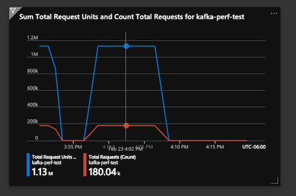
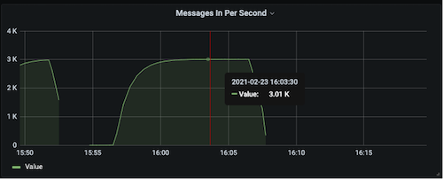
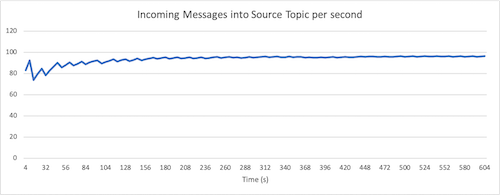
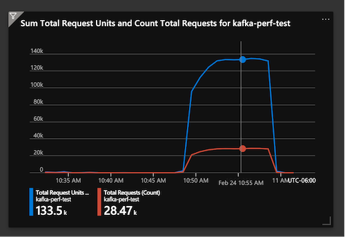
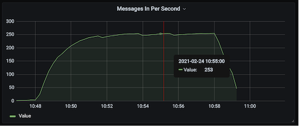

# Cosmos DB Connectors Performance Testing and Results

## Test Environment

In order to easily and quickly deploy and tear-down the testing workloads, we've used a Kubernetes Cluster (specifically an Azure Kubernetes Service) as the foundation. The following is a list of specifications for the AKS Cluster.

- 3 nodes each with VM flavor `Standard_F4s_v2`
- `Standard_F4s_v2` consists of 4 vCPUs, 8 GiB memory, 32 GB SSD storage. More info can be found in these [docs](https://docs.microsoft.com/en-us/azure/virtual-machines/fsv2-series)
- Kubernetes Version: `1.19.6`
- Helm version: `v3.3.4`

### Kafka Installation

The main Kafka backend was installed via the upstream [Confluent Inc. helm charts](https://github.com/confluentinc/cp-helm-charts) using the default values. However, only the following subset of the Kafka services were included in the installation:

- Kafka Brokers (3 replicas)
- ZooKeeper (3 replicas)
- Confluent REST Proxy
- Confluent Schema Registry

### Kafka Connect Installation

The connect cluster used for the performance testing consists of **three** workers (pods in the k8s context). Each worker pod has the following specifications:

- 2.66 CPUs (approx. 8 cores across all 3 workers)
- 2Gib Memory
- 2GB Heap

The worker pods are built with a [custom Docker image](../src/docker/Dockerfile), created using the upstream Kafka connect image as a base and the Cosmos DB connectors code installed on top.

Exact installation steps for Kafka and the Connect cluster can be found in this [documentation](https://github.com/microsoft/kafka-connect-cosmosdb/tree/perf-testing/perf#deploy-kafka-and-kafka-connect-with-helm).

## Sink Connector Performance

### Test setup

#### Load Client

We used the `kafka-producer-perf-test` CLI to generate load into a single Kafka topic. The load is also sent for a duration of 10 minutes. One thing to note is that load client is run as a pod in the same namespace that the Kafka pods are installed, so the traffic is sent via the local network.

- Single Topic
- Message Size: 100 Bytes of JSON data
- Topic throughput: 3000 Messages/sec, equating to 300 KB/s
- Number of topic partitions: 60
- Topic Replication factor: 3

#### Cosmos DB

The driver script creates a Cosmos DB SQL Database with throughput fixed at 20,000 RU/s. Given the number of records sent during the load (3000 msgs/s), this throughput is ideal such that the Cosmos database won’t be throttling any requests.

#### Sink Connector Config

The main thing to note is that we’re using the same number of tasks (60) as the number of topic partitions (each topic should handle a single partition). We also added the `insertUUID` SMT to the connector since the load does not have any `id` fields that are required when creating records in Cosmos DB. More information about the `insertUUID` SMT can be found in the [Sink Connector documentation](./README_Sink.md#single-message-transforms).

```json

{
    "name": "cosmosdb-sink-connector",
    "config": {
        "connector.class": "com.azure.cosmos.kafka.connect.sink.CosmosDBSinkConnector",
        "tasks.max": "5",
        "topics": "sink",
        "value.converter": "org.apache.kafka.connect.json.JsonConverter",
        "value.converter.schemas.enable": "false",
        "key.converter": "org.apache.kafka.connect.json.JsonConverter",
        "key.converter.schemas.enable": "false",
        "connect.cosmosdb.connection.endpoint": "<redacted>",
        "connect.cosmosdb.master.key": "<redacted>",
        "connect.cosmosdb.databasename": "kafkaconnect",
        "connect.cosmosdb.containers.topicmap": "sink#kafka",
        "transforms": "insertID",
        "transforms.insertID.type": "com.github.cjmatta.kafka.connect.smt.InsertUuid$Value",
        "transforms.insertID.uuid.field.name": "id"
    }
}

```

### Results











